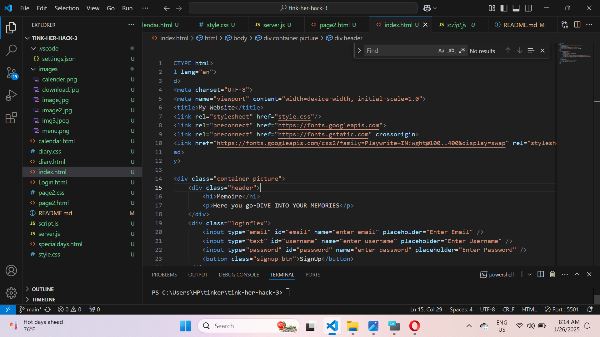
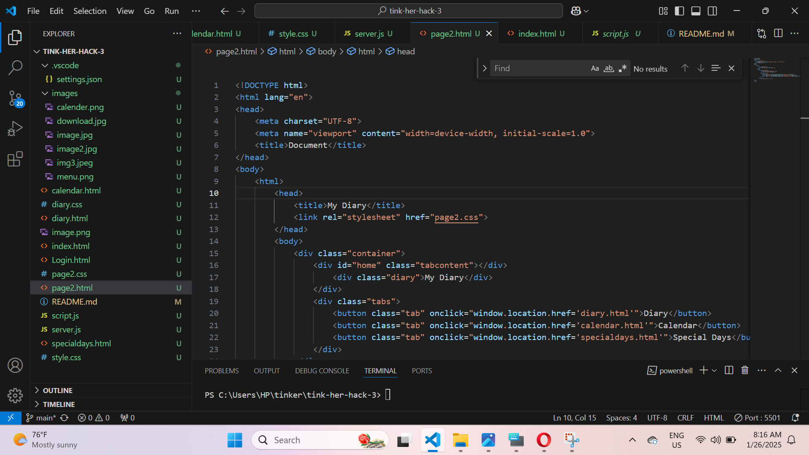
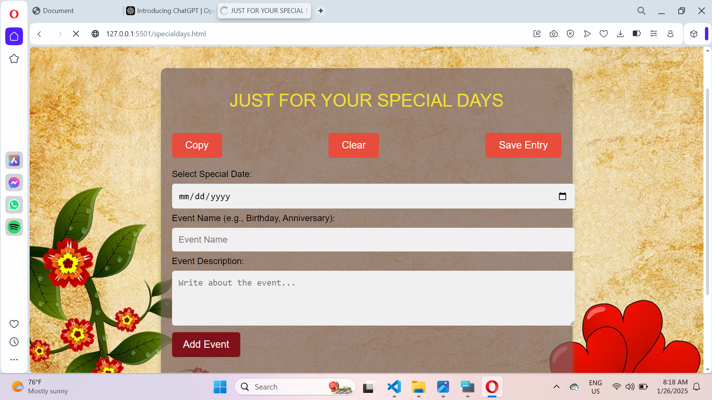

# Digital Diary 🎯

## Basic Details
### Team Name: innovision

### Team Members
- Member 1: mufeedha-nss collage of engineering ,palakkad
- Member 2: anagha cv-nss collafge of engineering ,palakkad

### Hosted Project Link
[mention your project hosted project link here]

### Project Description
a digital diary website allows users to securely record and organize their daily thoughts,memories and reflections online.it offers options to send notifications or reminders via email.

### The Problem statement
people often struggle to keep track of important dates and document personal experiences,leading to missed opportunities for celebration and connection.

### The Solution
there need a digital diary that combines diary writing a calender for event management and timely email notifications for special occasions to help users stay connected and organized.

## Technical Details
### Technologies/Components Used
For Software:
- html,css,javascript
- vscode ,firebase

### Implementation
For Software:
# Installation
[commands]

# Run
[commands]

### Project Documentation
For Software:

# Screenshots (Add at least 3)
code for signup page.
code for homepage.
!tab for adding special days.

# Build Photos

### Project Demo
# Video
ere]
*Explain what the video demonstrates*

# Additional Demos
[Add any extra demo materials/links]

## Team Contributions
- [Name 1]: [Specific contributions]
- [Name 2]: [Specific contributions]
- [Name 3]: [Specific contributions]

---
Made with ❤️ at TinkerHub

